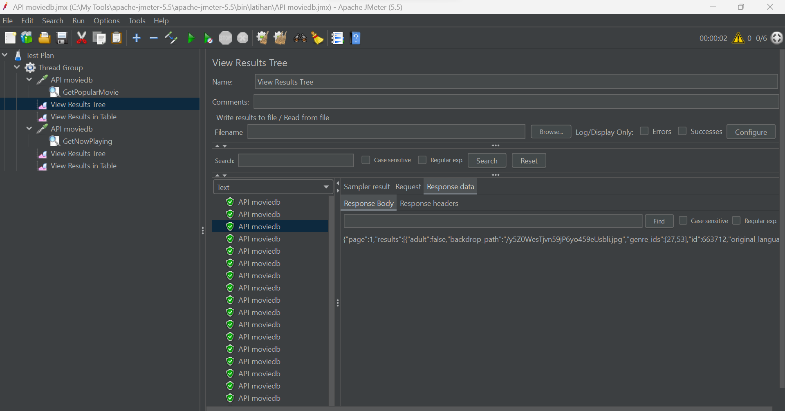

## performance testing menggunakan JMeter API moviedb
### API Moviedb Popular movie

### Get Popular Movie Response

### Result Tree Get Popular Movie

### Result Table Get Pupular Movie

### API Moviedb Now Playing

### Get Now Playing Movie Response

### Result Tree Get Now Playing 

### Result Table Get Now Playing

### Graph Result

